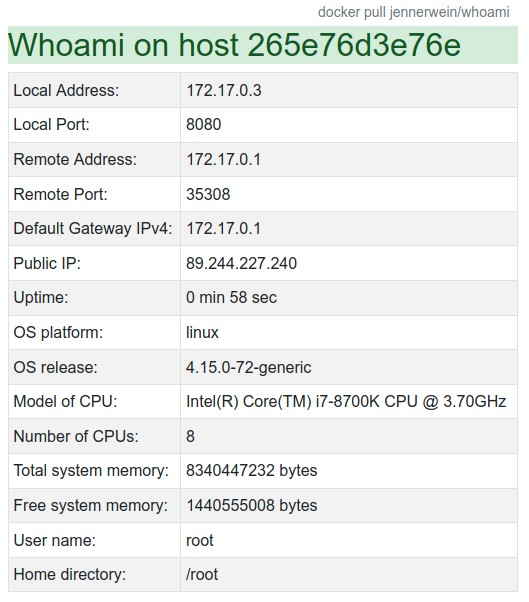

# whoami
A server that gives information about the container environment such as:

Start the **node app** with the command `node app/server` (of course, after `npm install`).
You can access the server via <http://127.0.0.1:8080> .

Start the **container** with:

`docker run -p 8080:8080 --name whoami -d jennerwein/whoami`
